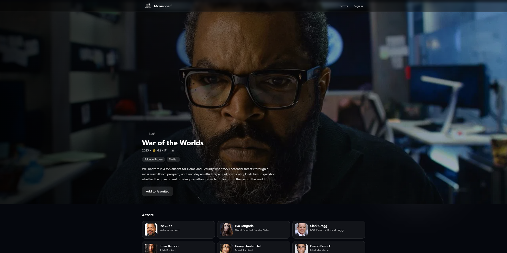
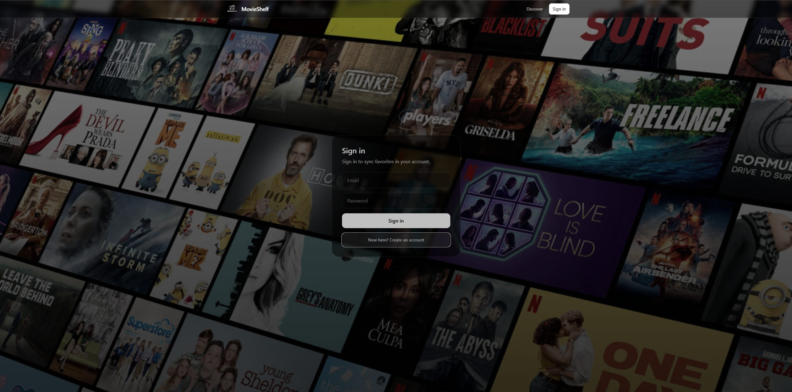
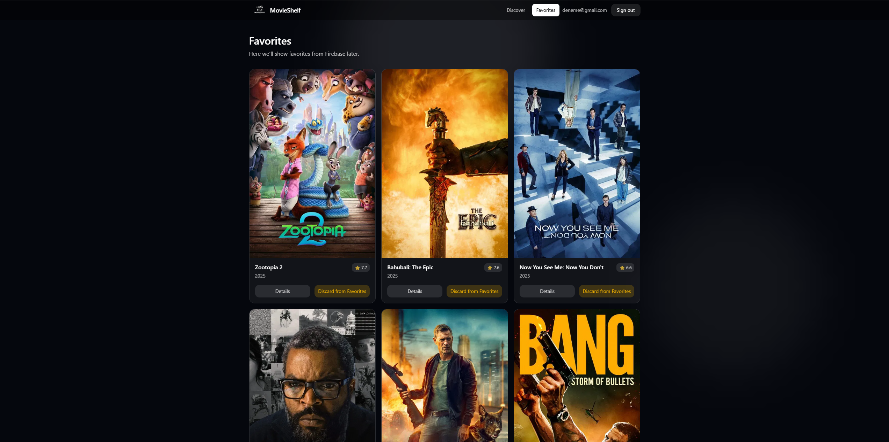

# 🎬 MovieShelf

MovieShelf is a modern movie discovery web app built with **React + TypeScript**, powered by the **TMDB API** and **Firebase**.

It allows users to explore popular movies, search with real-time feedback, view detailed movie information, and save favorites synced across devices.

This project is designed and developed as a **portfolio-level product**, not a tutorial.

---

## ✨ Features

- 🔍 Search movies with debounce & request cancellation
- 🎞️ Netflix-style featured hero slider
- 📄 Movie detail pages with cast information
- ❤️ Add / remove favorites
- 🔐 Firebase Authentication (Email / Password)
- ☁️ Favorites synced with Firestore
- ⚡ Optimistic UI updates
- 🧠 Clean service-layer API architecture

---

## 🛠️ Tech Stack

- **Frontend:** React, TypeScript, Vite
- **Styling:** Tailwind CSS
- **API:** TMDB (The Movie Database)
- **HTTP Client:** Axios
- **Auth & Database:** Firebase Auth & Firestore
- **Deployment:** Vercel

---

## 📁 Project Structure

src/
├─ services/ # API & Firestore logic (Axios-based)
├─ types/ # TypeScript models
├─ components/ # Reusable UI components
├─ pages/ # Route-level pages
├─ hooks/ # Custom hooks
├─ firebase/ # Firebase config


## Project Images

<p align="center">
    Discover Page
  
</p>

<p align="center">
    Movie Detail
  
</p>

<p align="center">
    Login Screen
  
</p>

<p align="center">
    Favorites
  
</p>


## 🔐 Environment Variables

Create a `.env` file in the project root:

VITE_TMDB_API_KEY=your_tmdb_api_key
VITE_FIREBASE_API_KEY=your_firebase_api_key
VITE_FIREBASE_AUTH_DOMAIN=your_domain
VITE_FIREBASE_PROJECT_ID=your_project_id
VITE_FIREBASE_STORAGE_BUCKET=your_bucket
VITE_FIREBASE_MESSAGING_SENDER_ID=your_sender_id
VITE_FIREBASE_APP_ID=your_app_id


> ⚠️ `.env` file is ignored by Git and should be configured in deployment settings.


## 🚀 Getting Started

```bash
npm install
npm run dev
📌 Notes
This project focuses on real-world API usage, state management, and clean architecture.

Advanced topics (route guards, real-time listeners, etc.) are intentionally layered step by step.

👤 Author
Mehmet Höke
Frontend / Mobile Developer
React • React Native • TypeScript • Firebase